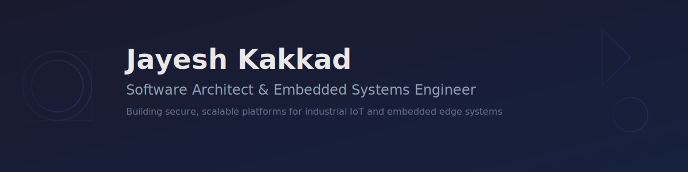

<div align="center">
  
</div>

<div align="center">
  
### Karlsruhe, Germany

[](https://jayesh-kakkad.com)
[](https://www.linkedin.com/in/jayesh-kakkad)
[](mailto:contact@jayesh-kakkad.com)
[](https://www.youtube.com/@Cyberfolio_Chronicles)

</div>

<br>

<div align="center">

## What I Do

</div>

```text
I architect and build production systems where hardware constraints meet 
software scale—from embedded Linux video pipelines to full-stack web platforms.
```

<table>
<tr>
<td width="50%">

**Platform Architecture**
- Secure-by-design industrial IoT systems
- Multi-tenant edge device orchestration
- Microservices & distributed systems

**Embedded Engineering**
- V4L2/GStreamer video pipelines
- Embedded Linux (Yocto, PTXdist)
- Real-time processing on ZynqMP

</td>
<td width="50%">

**Full-Stack Development**
- SvelteKit, React, TypeScript
- PostgreSQL, FastAPI, Node.js
- ERP integrations & workflow automation

**Security & Best Practices**
- OWASP Top 10 & IoT Top 10
- Threat modeling & secure SDLC
- Penetration testing (Kali toolchain)

</td>
</tr>
</table>

<br>

<div align="center">

## Core Domains

</div>

<table>
<tr>
<td>

### Industrial Camera Systems
Architecting embedded firmware and backend systems for real-time image capture, processing, and analysis on custom hardware platforms.

</td>
</tr>
<tr>
<td>

### Embedded Linux Video Pipelines
Deep experience with V4L2, GStreamer, codec optimization, and kernel-space video subsystems for resource-constrained devices.

</td>
</tr>
<tr>
<td>

### Full-Stack Web Applications
Building scalable, maintainable web platforms with modern frameworks, focusing on developer experience and performance.

</td>
</tr>
<tr>
<td>

### Security Engineering
Threat modeling, secure SDLC, IoT security (OWASP IoT Top 10), and hands-on penetration testing with industry-standard tools.

</td>
</tr>
<tr>
<td>

### Workflow Automation & ERP Integration
Connecting disparate business systems (Salesforce, Monday.com) with resilient, auditable workflows for manufacturing and logistics.

</td>
</tr>
</table>

<br>

<div align="center">

## Tech Stack

</div>

<div align="center">

**Languages**


**Frontend & UI**


**Backend & Databases**


**Embedded & Systems**


**DevOps & Tools**


**Security Tools**


</div>

<br>

<div align="center">

## Featured Projects

</div>

<table>
<tr>
<td width="50%">

### [EdgeFleet](https://github.com/JayeshKakkad-Rotoclear/edgefleet)
**Secure Edge Device Orchestration Platform**

Multi-tenant platform for managing industrial IoT devices with real-time telemetry, remote configuration, OTA updates (RAUC), and secure command execution.

**Tech:** `FastAPI` `PostgreSQL` `SvelteKit` `Docker` `MQTT` `RAUC`

</td>
<td width="50%">

### [Video Pipeline Lab](https://github.com/JayeshKakkad-Rotoclear/video-pipeline-lab)
**V4L2/GStreamer Concepts Simulator**

Educational platform for learning embedded video pipeline concepts without physical hardware. Interactive simulator with performance profiling.

**Tech:** `V4L2` `GStreamer` `Embedded Linux` `TypeScript` `React`

</td>
</tr>
<tr>
<td width="50%">

### [SecureEdge](https://github.com/JayeshKakkad-Rotoclear/secure-edge)
**IoT Device Security Dashboard**

Risk assessment platform mapping OWASP IoT Top 10 vulnerabilities. Automated scanning and remediation workflows for industrial IoT deployments.

**Tech:** `IoT Security` `OWASP IoT Top 10` `FastAPI` `PostgreSQL`

</td>
<td width="50%">

### [FlowSync](https://github.com/JayeshKakkad-Rotoclear/flow-sync)
**ERP Workflow Automation Platform**

Visual workflow builder connecting Salesforce, Monday.com, and manufacturing systems. Enables auditable automation with RBAC and retry logic.

**Tech:** `ERP Integration` `React` `PostgreSQL` `RabbitMQ` `Docker`

</td>
</tr>
<tr>
<td width="50%">

### [System Design Studies](https://github.com/JayeshKakkad-Rotoclear/system-design-studies)
**Architecture Case Studies**

In-depth explorations of system design challenges: API gateways, rate limiting, distributed tracing, observability, and secure-by-design principles.

**Tech:** `System Design` `Architecture` `Distributed Systems`

</td>
<td width="50%">

### [Portfolio](https://github.com/JayeshKakkad-Rotoclear/portfolio)
**Professional Portfolio Website**

Premium multi-page portfolio with React, TypeScript, Material-UI, and Framer Motion. Focus on performance, accessibility, and security.

**Tech:** `React` `TypeScript` `Material-UI` `Framer Motion` `Vite`

</td>
</tr>
</table>

<br>

<div align="center">

## GitHub Activity & Stats

</div>

<div align="center">
  


</div>

<details>
<summary>Additional Stats</summary>
<br>

<div align="center">


</div>

</details>

<br>

<div align="center">

## Mentoring & Teaching

</div>

<table>
<tr>
<td align="center">

**Volunteer Instructor – [ReDI School of Digital Integration](https://www.redi-school.org/)**

*March 2023 – Present*

Teaching programming fundamentals (Python, JavaScript, web development) to students from underrepresented backgrounds. Providing one-on-one mentoring on career development, technical problem-solving, and navigating the tech industry.

</td>
</tr>
</table>

<br>

<div align="center">

## Content & Learning

</div>

<table>
<tr>
<td>

**[YouTube: Cyberfolio Chronicles](https://www.youtube.com/@Cyberfolio_Chronicles)**

Tutorials and demonstrations in cybersecurity, cloud security, and hands-on labs:

- **[File Integrity Monitor with PowerShell](https://youtu.be/uDd5R2uEIL0)** – Building FIM from scratch
- **[Cloud-based Home Lab with AWS](https://youtu.be/xh2xLN_uBlE)** – Setting up security lab infrastructure
- **[Live RDP Brute Force Detection with Azure Sentinel](https://www.youtube.com/watch?v=yU_YuGYtJGU)** – SIEM & threat detection
- **[Ransomware PoC (C#)](https://youtu.be/dab8pQ5UVjs)** – Understanding ransomware mechanics
- **[Vulnerability Management with Nessus Essentials](https://youtu.be/mnjxUoBTyKs)** – Practical vulnerability scanning

</td>
</tr>
</table>

<br>

<div align="center">

## Let's Connect

</div>

<div align="center">

Looking to collaborate on **embedded systems**, **platform architecture**, or **secure-by-design engineering**?

**Reach out via:**

[](mailto:contact@jayesh-kakkad.com)
[](https://www.linkedin.com/in/jayesh-kakkad)
[](https://jayesh-kakkad.com)
[](https://www.youtube.com/@Cyberfolio_Chronicles)

</div>

<br>

<div align="center">
  
---

*Building secure, scalable systems at the intersection of hardware and software*

</div>
