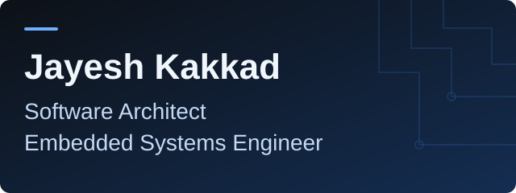

**English** · [Deutsch](README.de.md)

**Building secure, scalable platforms where embedded hardware meets modern software.**

[Portfolio ↗](https://www.jayesh-kakkad.de) · [LinkedIn ↗](https://www.linkedin.com/in/jayesh-kakkad) · [Email ↗](mailto:contact@jayesh-kakkad.com)

[About](#about-me) · [Engineering](#what-i-build) · [Toolkit](#tech-stack) · [Teaching](#mentoring--teaching)

## About Me

I work across embedded firmware, backend systems and industrial camera platforms. My focus is the complete path from a device and its data to useful, maintainable software.

Alongside engineering, I volunteer as an instructor at [ReDI School of Digital Integration](https://www.redi-school.org/), sharing practical knowledge in programming and cybersecurity.

**Ask me about:** V4L2 and GStreamer pipelines, SvelteKit, IoT security and system design.

## What I Build

### 01 / Platform Architecture
Secure industrial IoT platforms, edge device orchestration, distributed services and workflow integrations.

### 02 / Embedded Engineering
Embedded Linux with Yocto and PTXdist, V4L2 and GStreamer video pipelines, and software for ZynqMP and ARM platforms.

### 03 / Full-Stack Development
Interfaces built with SvelteKit, React and TypeScript; APIs and data layers with FastAPI, Node.js, PostgreSQL and Prisma. Self-hosted deployment with Docker.

### 04 / Security Engineering
Threat modeling, secure development and practical security testing. Tools include Burp Suite, Nessus, Wireshark and the Kali toolchain.

## Tech Stack

**Languages**

**Frontend & Backend**

**Data & Infrastructure**

Embedded and security toolkit

**Embedded:** Embedded Linux · Yocto · PTXdist · V4L2 · GStreamer · C / C++

**Security:** OWASP Top 10 · OWASP IoT Top 10 · Threat modeling · Burp Suite · Nessus · Wireshark

## Explore My Work

Browse the complete collection, with project context on my website and source code in GitHub.

[View project catalogue ↗](https://www.jayesh-kakkad.de/projects/) · [Browse repositories ↗](https://github.com/JayeshKakkad-Rotoclear?tab=repositories)

GitHub activity and statistics

## Mentoring & Teaching

**Volunteer Instructor · [ReDI School of Digital Integration](https://www.redi-school.org/)**

Programming fundamentals, cybersecurity and hands-on technical problem-solving. I enjoy making complex topics approachable and helping learners develop confidence through practice.

## Content & Learning

[**Cyberfolio Chronicles ↗**](https://www.youtube.com/@Cyberfolio_Chronicles) — hands-on labs in cybersecurity, cloud security and embedded systems.

Browse tutorials and labs

| Video | Topic |
|-------|-------|
| [File Integrity Monitor with PowerShell](https://youtu.be/uDd5R2uEIL0) | Building FIM from scratch |
| [Cloud-based Home Lab with AWS](https://youtu.be/xh2xLN_uBlE) | Security lab infrastructure |
| [Live RDP Brute Force Detection — Azure Sentinel](https://www.youtube.com/watch?v=yU_YuGYtJGU) | SIEM &amp; threat detection |
| [Ransomware PoC (C#)](https://youtu.be/dab8pQ5UVjs) | Understanding ransomware mechanics |
| [Vulnerability Management with Nessus Essentials](https://youtu.be/mnjxUoBTyKs) | Practical vulnerability scanning |

---

### Let's Connect

Interested in embedded systems, platform architecture or secure engineering? Let's talk.

[contact@jayesh-kakkad.com](mailto:contact@jayesh-kakkad.com) · [LinkedIn](https://www.linkedin.com/in/jayesh-kakkad) · [Website](https://www.jayesh-kakkad.de)
